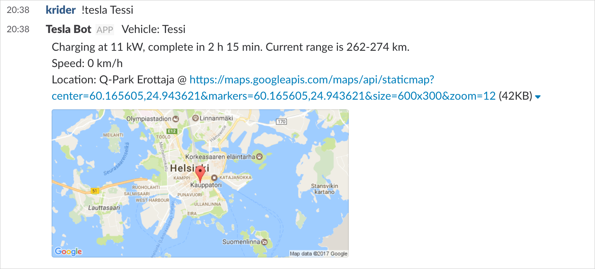

tesla-slack
===========

Integrates your Tesla Model S to https://slack.com

Uses https://github.com/hjespers/teslams for Tesla portal integration.

Take a look at http://docs.timdorr.apiary.io for reference

I [blogged](blogpost.md) about the integration at Reaktor's site: http://reaktor.fi/blog/talking-tesla

Requirements
------------

Node.js & NPM from http://nodejs.org

The following ENV variables:
* TESLA_USERNAME - username to the Tesla portal
* TESLA_PASSWORD - password to the Tesla portal
* SLACK_RECEIVE_TOKEN - for "outgoing Slack webhooks"
* SLACK_SEND_TOKEN - for "incoming Slack webhooks"
* SLACK_DOMAIN - Slack domain name where notifications are sent to
* SLACK_CHANNEL - Slack channel where notifications are sent to
* MONGOHQ_URL or MONGOLAB_UR - or an instance of mongodb running at localhost with db "tesla" available

Testing locally
---------------

Start it (automatically relaunching if you modify any of the code)

    ./start.sh

Fetch battery information:

    curl --data "token=<insert-SLACK_RECEIVE_TOKEN-here>&text=battery" http://localhost:5000/slack

Fetch position information:

    curl --data "token=<insert-SLACK_RECEIVE_TOKEN-here>&text=position" http://localhost:5000/slack

Fetch vehicle information:

    curl --data "token=<insert-SLACK_RECEIVE_TOKEN-here>&text=vehicle" http://localhost:5000/slack

Works nicely when deployed to Heroku.

Point the outoing Slack webhook configuration to /slack on your node.js instance.
